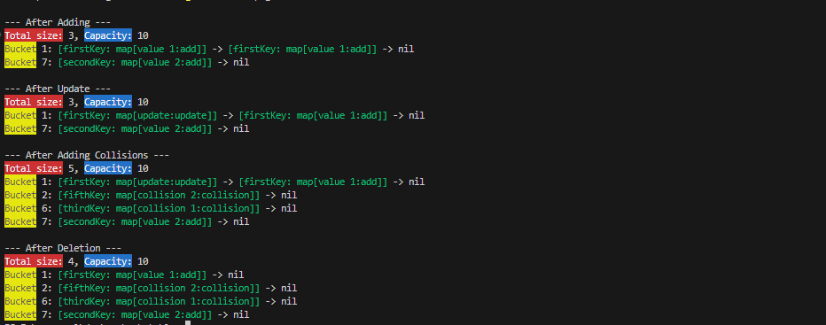

# Go HashMap

A simple implementation of a HashMap in Go with separate chaining using linked lists. This package is intended for learning and experimentation with core data structure concepts.

### ⚠️ Note: This package is still under development. Features and behaviors may change.

## 📦 Package Overview

This package provides a basic hash table (HashTable) with common operations:

- Add key-value pairs
- Get values by key
- Update existing values
- Delete keys
- Print the hash table structure

### Internally, it uses:

- Hashing (FNV hash function)
- Buckets (fixed or dynamically sized)
- Linked list chaining to handle collisions

## Internal Logic (Pseudo Thinking)

### For Add Entry

- Get index using hash(key)
- Create a new entry with key and value
- Check if bucket at that index is empty:
  - If yes → insert the new entry directly
  - If no →
    - Traverse the linked list at that index
    - Move to the last node in the chain (where Next is nil)
    - Append the new entry at the end
- Increase the size counter

### For Get Entry

- Get index using hash(key)
- Access the linked list at that index
- Traverse through each node in the chain:
  - If key matches → return the value
  - If not → move to the next node
- If traversal completes without finding the key → return error

### For Delete Entry

- Get index using hash(key)
- Access the head of the linked list at that index
- Use two pointers: current (to track node), previous (to track node before current)
- Traverse the linked list:
  - If key matches:
    - If current is the head → update bucket to current.Next
    - Else → set previous.Next to current.Next
    - Decrease the size counter
    - Return success
  - Else → move both pointers forward
- If traversal completes without finding the key → return error

### For Update Entry

- Get index using hash(key)
- Traverse through the linked list at that index
- For each node:
  - If key matches → update the value and return success
- If traversal completes without finding the key → return error

### For Print Table

- Loop through all buckets (from index 0 to capacity - 1)
- For each bucket:
  - Traverse the linked list
  - Print each entry in the format [Key:Value] -> ... -> nil

## 📈 Features in Progress

- Dynamic resizing (grow/shrink on threshold)
- Load factor tracking
- Generic types (support other value types)
- Iterator support
- Key Existence Check
- List Keys and Values
- Clear / Reset
- Save & Load (load from json and export as json)
- Thread Safety
- Error Handling with Reason
- Full Unit Test Suite

## 🛠️ Example Usage

`````golang
ht := table.NewHashTable(10)
ht.Add("firstKey", map[string]string{"value": "add"})
value, _ := ht.Get("firstKey")
ht.Update("firstKey", map[string]string{"value": "updated"})
ht.Delete("firstKey")
ht.Print()````

`````

## 🛠️ Example Output


